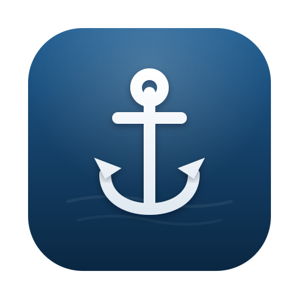

<div align="center">



# Harbor

**Know what’s running. Stop the port chaos.**

Harbor makes local servers on your Mac understandable—what is running, where it
came from, and which copies look duplicated. Start a whole project in one click,
or let Claude or Codex inspect and operate projects you have approved.

[**Download Harbor**](https://github.com/luke-fairbanks/harbor-mcp/releases/latest) ·
[Quick start](#quick-start) · [Connect an AI agent](#connect-claude-or-codex)

macOS 11+ · Apple Silicon + Intel · Signed and notarized · No account · MIT

</div>

> **Note:** Harbor is unrelated to the
> [CNCF Harbor](https://goharbor.io) container registry.

## Why Harbor

### See the servers already running on your Mac

Harbor inventories current-user TCP listeners and shows their port, process,
command, working folder, HTTP response, and likely framework. Strong evidence
maps servers to registered projects; probable duplicate project runs and
network-visible binds are flagged while unknown listeners remain visible.

### Start a project, not a pile of terminals

Add a folder and review the services Harbor detects. It starts dependencies in
order, streams logs, monitors health and resources, and resolves project ports.
Before starting another copy, Harbor checks whether the project already has a
matching server it can safely reuse.

### Give coding agents the same source of truth

Harbor exposes its live project and server state through a loopback-only MCP
server. Claude and Codex can inspect local listeners, detect a project, read
logs, and operate registered projects. A config created by an agent stays paused
until you approve that exact config in Harbor.

## Install

### Download the app

Download the **`.dmg`** from the
[latest release](https://github.com/luke-fairbanks/harbor-mcp/releases/latest),
open it, and drag Harbor to Applications.

### Install with Homebrew

```bash
brew install --cask luke-fairbanks/tap/harbor
```

Production releases are signed by Faba Development and notarized by Apple.
Harbor supports macOS 11 Big Sur or later on Apple Silicon and Intel Macs.

Starting with v0.4.0, Harbor checks for signed updates shortly after launch and
every six hours. It always asks before installing. You can also check manually
from **project settings → Harbor updates**. Managed project processes remain
online while Harbor updates and relaunches.

## Quick start

1. Open Harbor and choose **Add project**, or drag a project folder onto the
   window.
2. Review the detected services and commands, then choose **Add to Harbor**.
3. Open the project and choose **Start project**.
4. Open **Local servers** to see its ports alongside other listeners already
   running under your macOS user.

Harbor recognizes common JavaScript frameworks and package managers, Django,
FastAPI, Flask, Go, Rails, and static sites. If detection misses, you can import
or edit a `harbor.json` configuration instead.

## Conservative by design

- **Observation is not ownership.** Matching a server to a project does not give
  Harbor permission to stop it.
- **Duplicate prevention favors certainty.** Harbor reuses a strongly matched
  server; ambiguous matches block launch and ask you to inspect them.
- **Cleanup is identity-protected.** Stop is offered only for isolated,
  untracked servers. Harbor rechecks PID, process start time, and port before it
  signals the process, and refuses terminals, IDEs, coding agents, and Harbor
  itself. “Safe to stop” describes process isolation—not whether the process has
  unsaved work.
- **Agent-written commands require local approval.** Approval applies to the
  exact registered config. Changing it through MCP requires a new approval.
- **MCP stays local.** The server binds to `127.0.0.1` and uses a new bearer token
  on every Harbor launch. Its descriptor and Harbor’s app-data directory are
  owner-only on macOS, and the native bridge verifies listener ownership before
  forwarding credentials.
- **Fix with AI is explicit.** When you invoke it, Harbor passes the service
  command, working path, exit state, and recent logs to your installed Codex or
  Claude CLI. That data is then handled under the privacy terms of whichever
  provider Harbor invokes.

## What Harbor manages

- Dependency-aware start, stop, restart, and one-click project launch
- Preferred-to-next-free port allocation on IPv4 and IPv6
- `${PORT}` and `${services.<name>.port}` rewiring between services
- Recognition of commands that pin their own port
- HTTP, TCP, log-pattern, and process-alive readiness checks
- Live logs, CPU, and memory for each managed process group
- Opt-in crash restart with bounded backoff
- Re-adoption of verified Harbor processes that survive an app restart
- A menu-bar popover for common project actions
- Framework-aware project detection and editable `harbor.json` configs

## Local server inventory

The **Local servers** view scans TCP listeners owned by your current macOS user.
It combines process, working-directory, command, port, and bounded HTTP evidence
to classify each listener as unknown, matched, Harbor-managed, or eligible for
identity-safe cleanup.

Harbor can recognize a strongly matching server on a service’s preferred port
before allocating another one. If that process shares a group with a terminal,
IDE, Claude, or Codex, Harbor leaves it monitor-only and will not take down the
host process.

## Connect Claude or Codex

Open **AI connections** and choose **Connect Claude Code**, **Connect Desktop**,
or **Connect Codex**. The guided setup installs Harbor's signed, owner-only
native bridge. New client configurations contain only its stable command path:
no bearer token, environment variables, Node.js installation, or first-run
download is required. If Harbor is closed, the bridge opens it quietly in the
background. After connecting for the first time, start a new client session (or
fully quit and reopen an already-running client) so it loads the new entry.

The client-owned stdio process stays connected while Harbor quits and reopens.
It re-reads Harbor's protected endpoint descriptor, follows token and port
rotations, and replays the MCP backend lifecycle before forwarding the next
request. Upgrading from Harbor v0.4.2's legacy launcher requires one final client
restart; normal Harbor restarts after that do not. A later Harbor update that
replaces the bridge binary itself also requires a client restart before the
running client can use the new bridge code.

Harbor distinguishes a saved configuration from an observed **Bridge running**
process; the latter means the client launched the bridge, while the client's own
MCP tool list is the final confirmation that it accepted the catalog.

Advanced users can connect directly over Streamable HTTP. Read the current port
and token from
`~/Library/Application Support/com.harbor.desktop/mcp.json`; the port can differ
from 7777 and the token changes after every Harbor restart.

```bash
SETTINGS="$HOME/Library/Application Support/com.harbor.desktop/mcp.json"
PORT="$(plutil -extract port raw -o - "$SETTINGS")"
TOKEN="$(plutil -extract token raw -o - "$SETTINGS")"
claude mcp add harbor --scope user --transport http "http://127.0.0.1:${PORT}/mcp" \
  --header "Authorization: Bearer ${TOKEN}"
```

Then try:

> What local servers are running, and do any look duplicated?

### MCP tools

| Tool | Purpose |
|---|---|
| `list_apps` | List registered projects and their current run status |
| `app_status(app)` | Inspect services, resolved ports, and the port plan |
| `detect_app(path)` | Scan a folder and propose a config without saving it |
| `register_app(config)` | Add or replace a config as approval required |
| `start_app(app, profile?)` | Start an approved project or profile |
| `stop_app(app)` | Stop Harbor-managed services for a project |
| `restart_app(app, profile?)` | Restart an approved project or profile |
| `get_logs(app, service, lines?)` | Read recent captured logs |
| `list_local_servers` | Inventory listeners, matches, and probable duplicates |
| `stop_local_server(pid, port, startedAt)` | Request identity-safe cleanup of an isolated server |
| `open_app(app)` | Open a running project’s primary URL |

## Build from source

Harbor uses Tauri 2 with a Rust core and a React 19 / Radix Themes interface.

```bash
npm install
npm run prepare:bridge
npm run tauri dev
```

Run the local production build without updater artifacts:

```bash
npm run tauri:build:local
```

### Verify changes

```bash
npm run prepare:bridge
npm test
npm run build
npm run test:rust

cargo fmt --manifest-path src-tauri/Cargo.toml --all -- --check
cargo fmt --manifest-path src-tauri/mcp-bridge/Cargo.toml --all -- --check
cargo clippy --manifest-path src-tauri/Cargo.toml --locked --all-targets -- -D warnings
cargo clippy --manifest-path src-tauri/mcp-bridge/Cargo.toml --locked --all-targets -- -D warnings
cargo test --manifest-path src-tauri/mcp-bridge/Cargo.toml --locked
```

When changing MCP schemas, transport, authentication, or the native bridge,
start the patched Harbor build after using one-click setup at least once, then
exercise the exact installed Claude/Codex bridge for 90 seconds:

```bash
node scripts/mcp-bridge-soak.mjs --restart-harbor --duration-ms 90000 --interval-ms 30000
```

The harness performs Claude-compatible initialization, validates all advertised
tool schemas, and repeatedly calls the read-only `list_apps` tool. It must end
with `PASS` and no schema, authentication, transport, or reconnect errors.

See [DESIGN.md](./DESIGN.md) for the shipped architecture,
[ROADMAP.md](./ROADMAP.md) for planned work, and
[DISTRIBUTING.md](./DISTRIBUTING.md) for the signed release process.

## Feedback and contributing

Found a listener Harbor misidentified, a project it could not detect, or an MCP
client that would not connect? [Open a guided issue](https://github.com/luke-fairbanks/harbor-mcp/issues/new/choose).
Please remove tokens, credentials, `.env` contents, and private paths before
posting logs or commands.

Issues and pull requests are welcome. Security vulnerabilities should be
reported privately through
[GitHub’s security advisory form](https://github.com/luke-fairbanks/harbor-mcp/security/advisories/new).

## License

[MIT](./LICENSE) © Luke Fairbanks
