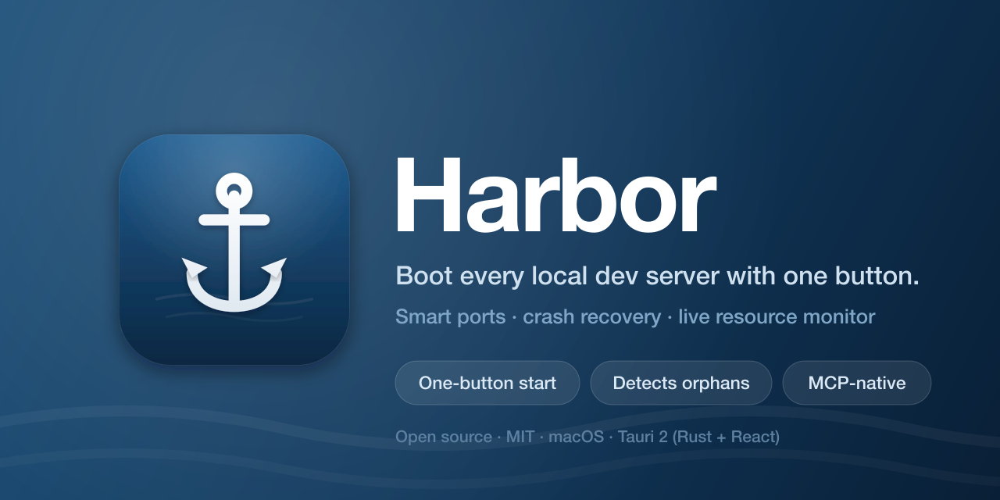

<div align="center">



</div>

# Harbor

A polished, native macOS app that boots all the local servers a project needs
with **one button** — with intelligent port allocation, crash recovery, and an
**MCP server** baked in so your Claude (or Codex) can discover, configure, and
drive your dev environment without you editing a single config file.

Local process managers exist (foreman, pm2, Tilt, Herd). **None are MCP-native.**
That's Harbor's point: register a project once, and from then on an AI agent can
detect what it needs, write the run config, start/stop everything with automatic
port allocation, watch resource usage, and read logs to debug.

> Stack: **Tauri 2** (Rust core + React 19 / Radix Themes UI). macOS only for now.
> See [`DESIGN.md`](./DESIGN.md) for the architecture and
> [`ROADMAP.md`](./ROADMAP.md) for the prioritized product path.

> **Note:** unrelated to the [CNCF Harbor](https://goharbor.io) container registry.

## Features

- **One-button start** with a topo-sorted dependency order and live log streaming.
- **Port intelligence** — preferred → next-free allocation probed on **both** IPv4
  and IPv6, with `${PORT}` / `${services.X.port}` placeholders resolved so a
  frontend automatically targets whatever port the backend actually got. Recognizes
  a command that pins its own port (e.g. `next dev -p 3002`) and never bumps it.
- **Local servers inventory** — one live view of every local dev server and
  infrastructure listener owned by your macOS user, including its URL, port,
  PID, command, working folder, HTTP status/title, and likely framework. Harbor
  maps strong matches to registered apps, flags probable duplicate project runs
  and network-visible binds, and keeps unknown listeners visible.
- **Detects already-running servers before allocating** — re-adopts processes a
  previous Harbor session left running and recognizes a matching external server
  on a service's preferred port *before* deciding to bump the port. A server that
  shares a terminal, IDE, Claude, or Codex process group remains monitor-only and
  blocks a duplicate launch; Harbor will not take down the host process.
- **Identity-safe cleanup** — isolated, untracked servers can be stopped from the
  inventory after confirmation. PID + process start time are rechecked immediately
  before signalling; shells, terminals, IDEs, agents, and Harbor itself are refused.
- **Auto-restart on crash** (opt-in per app) with bounded backoff and a give-up
  cap, plus native crash notifications — and it can tell a deliberate Stop apart
  from a crash, so it never fights you.
- **Live resource monitor** — CPU% and memory per service, summed over the whole
  process group, in the card and the menu-bar popover.
- **Menu-bar popover** to start/stop/open your servers without opening the window.
- **Fix with AI** — surfaces a service's error and hands a tailored prompt to a
  connected Claude/Codex (or runs it headless) to diagnose it.
- **Smart onboarding** — drag a project folder onto the window and Harbor scans it
  and proposes a config (Next/Vite/Remix/Nuxt/SvelteKit/Astro/Angular/CRA/Gatsby,
  Django/FastAPI/Flask, Go, Rails, static sites; pnpm/yarn/bun aware).
- **MCP-native** — an in-process Streamable-HTTP MCP server (bound to `127.0.0.1`,
  per-launch bearer token) exposes discovery and the whole lifecycle. One-click
  setup for Claude Code, Claude Desktop, and Codex uses a stable launcher that
  follows Harbor's live port/token and can quietly open Harbor after a reboot.
  Duplicate Harbor launches focus the existing instance instead of racing its
  endpoint descriptor.
- **Human approval for agent commands** — configs registered over MCP are saved as
  pending. Harbor shows the exact app configuration and will not execute it until
  a person approves it locally. MCP tools advertise read/write/destructive hints.

## Install

Download the **`.dmg`** from the
[latest release](https://github.com/luke-fairbanks/harbor-mcp/releases), open it,
and drag Harbor to Applications. Releases are signed and notarized when the
maintainer's Apple signing secrets are enabled; the release notes identify an
unsigned build and its one-time Gatekeeper step otherwise.

Or with Homebrew:

```bash
brew install --cask luke-fairbanks/tap/harbor
```

## Build it yourself

```bash
npm install
npm run tauri dev      # dev window + MCP server (prefers 127.0.0.1:7777)
npm run tauri build    # produces a .app / .dmg (unsigned unless you set up signing)
```

Maintainers: see [`DISTRIBUTING.md`](./DISTRIBUTING.md) for code signing,
notarization, and how to cut a release.

## Connect your Claude (or Codex)

Open **Connect your AI agents** (gear, bottom-left) for restart-safe one-click
setup (Claude Code, Claude Desktop, and Codex). For a manual native-HTTP setup,
read the current port and token from
`~/Library/Application Support/com.harbor.desktop/mcp.json`—the port can differ
from 7777 when another process already owns it.

The restart-safe launcher requires Node.js/npx and may fetch the pinned
`mcp-remote@0.1.38` adapter on first use. If npx is unavailable, use the manual
native-HTTP setup below, keep Harbor open while the client is running, and
update the client entry after each Harbor restart because the token is
session-scoped:

```bash
SETTINGS="$HOME/Library/Application Support/com.harbor.desktop/mcp.json"
PORT="$(plutil -extract port raw -o - "$SETTINGS")"
TOKEN="$(plutil -extract token raw -o - "$SETTINGS")"
claude mcp add harbor --scope user --transport http "http://127.0.0.1:${PORT}/mcp" \
  --header "Authorization: Bearer ${TOKEN}"
```

Then ask your agent to run `list_local_servers` first. It can inspect what is
already running, `detect_app` a new folder, register a proposed config for local
approval, then use `start_app`, `app_status`, `get_logs`, and `stop_app`.

## Concepts

- **App** — a registered project folder with a name, root, and services.
- **Service** — one long-running process: `{ name, cwd, command, port?, env,
  dependsOn[], healthCheck?, readyLogPattern? }`. `command`/`env` may contain
  `${PORT}` and `${services.X.port}` placeholders.
- **Profile** — a named service set (e.g. `default` = just the server, `dev` =
  server + web).
- **Port plan** — what each service preferred vs. the port it actually got, and
  how dependents were rewired.

## Tools

The embedded MCP server exposes:

| Tool | Purpose |
|------|---------|
| `list_apps` | Registered apps + current run status |
| `app_status(app)` | Per-service state, resolved ports, the port plan |
| `detect_app(path)` | Scan a folder, **propose** a config (does not save) |
| `register_app(config)` | Add/replace an app as **approval required** |
| `start_app(app, profile?)` / `stop_app(app)` / `restart_app(app, profile?)` | Lifecycle |
| `get_logs(app, service, lines?)` | Tail captured logs |
| `list_local_servers` | Inventory all local listeners, matches, and probable duplicates |
| `stop_local_server(pid, port, startedAt)` | Identity-safe cleanup of an isolated untracked server |
| `open_app(app)` | Open a running app's primary URL |

The server binds `127.0.0.1` only and requires a per-launch bearer token. Harbor
stores its app-data directory as owner-only (`0700`) and credential/config files
as owner-only (`0600`) on Unix.

## Module map (`src-tauri/src`)

| File | Responsibility |
|------|----------------|
| `model.rs` | Config + run types (serde) |
| `store.rs` | Flat-JSON registry, MCP settings, and the `runs.json` adoption record |
| `state.rs` | `AppState` shared by commands and the MCP server |
| `supervisor.rs` | Spawn in process groups, stream logs, health/ready, adoption, auto-restart, resource sampling, clean kill |
| `ports.rs` | Topo sort, dual-stack allocation, pinned-port detection, `${...}` resolution (unit-tested) |
| `health.rs` | TCP/HTTP readiness probes |
| `detect.rs` | `detect_app` framework heuristics (unit-tested) |
| `discovery.rs` | User-wide listener inventory, project matching, HTTP hints, duplicate grouping, identity-safe cleanup |
| `ops.rs` | Shared start/stop/restart/open logic (commands + MCP) |
| `commands.rs` | Tauri command surface |
| `mcp.rs` | axum + `rmcp` Streamable-HTTP server, bearer auth |
| `lib.rs` | Wires it together; hosts the MCP server on Tauri's runtime |

## Contributing

Issues and PRs welcome. The Rust core has unit + integration tests:

```bash
cd src-tauri && cargo test
npx tsc --noEmit   # from the repo root, typecheck the UI
```

## License

[MIT](./LICENSE) © Luke Fairbanks
